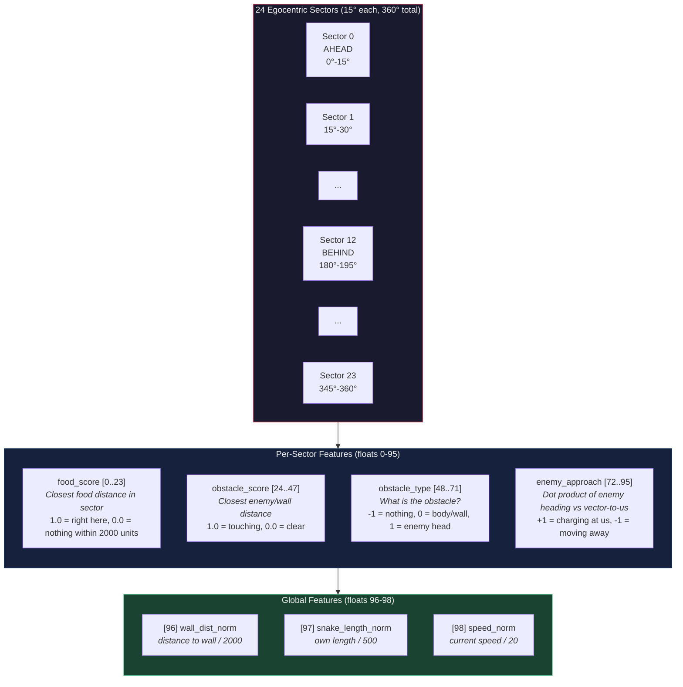

# SlitherBot
### Training System with AI LLM Support

An autonomous bot that plays [slither.io](http://slither.io) using deep reinforcement learning. The bot learns entirely from live gameplay — it controls a real browser, reads the game state through injected JavaScript, and gradually improves through a curriculum of increasingly difficult challenges.

The project started as an experiment to see if a DQN agent could learn survival skills in a competitive multiplayer environment where the rules are simple but the dynamics are chaotic. It turns out the answer is "yes, but it takes a lot of tuning."


## How it works

The training loop is straightforward:

1. A headless Chrome browser connects to slither.io
2. Injected JS extracts the game state (snake positions, food, map boundaries)
3. The state gets converted into a 128x128 pixel matrix + a 99-float sector vector
4. The neural network picks one of 10 actions (turn left/right at various angles, go straight, or boost)
5. The reward signal tells the network what worked and what didn't
6. Repeat thousands of times

The tricky part is everything in between — how to represent the game state, how to design rewards that actually teach useful behavior, and how to avoid the dozen ways training can go wrong.

## Architecture

### Neural Network

We use a **Hybrid Dueling DQN** — a network with **~1.4M trainable parameters** that takes two types of input simultaneously and produces Q-values for 10 possible actions.

#### Full Architecture Diagram

```mermaid
graph TB
    subgraph INPUT ["INPUT LAYER"]
        direction TB
        M["128x128 RGB Matrix<br/><i>3 channels x 4 frames = 12ch</i><br/>Food | Danger | Self"]
        S["99-float Sector Vector<br/><i>24 sectors x 4 features + 3 globals</i>"]
    end

    subgraph CNN ["CNN BRANCH — 4 Conv Layers"]
        direction TB
        C1["Conv2d Layer 1<br/>12ch → 32 filters<br/>kernel 8x8, stride 4<br/><b>Output: 32 x 31 x 31</b>"]
        A1["LeakyReLU α=0.01"]
        C2["Conv2d Layer 2<br/>32 → 64 filters<br/>kernel 4x4, stride 2<br/><b>Output: 64 x 14 x 14</b>"]
        A2["LeakyReLU α=0.01"]
        C3["Conv2d Layer 3<br/>64 → 64 filters<br/>kernel 3x3, stride 1<br/><b>Output: 64 x 12 x 12</b>"]
        A3["LeakyReLU α=0.01"]
        C4["Conv2d Layer 4<br/>64 → 64 filters<br/>kernel 3x3, stride 2<br/><b>Output: 64 x 5 x 5</b>"]
        A4["LeakyReLU α=0.01"]
        FL["Flatten<br/><b>→ 1600 neurons</b>"]

        C1 --> A1 --> C2 --> A2 --> C3 --> A3 --> C4 --> A4 --> FL
    end

    subgraph SEC ["SECTOR BRANCH — Radar Processing"]
        direction TB
        S1["FC Layer 1<br/>99 → 128 neurons"]
        SA1["LeakyReLU α=0.01"]
        S2["FC Layer 2<br/>128 → 128 neurons"]
        SA2["LeakyReLU α=0.01"]

        S1 --> SA1 --> S2 --> SA2
    end

    subgraph MERGE ["MERGE LAYER"]
        CAT["Concatenate<br/><b>1600 + 128 = 1728 neurons</b>"]
        MFC["FC Layer<br/>1728 → 512 neurons"]
        MA["LeakyReLU α=0.01"]

        CAT --> MFC --> MA
    end

    subgraph DUELING ["DUELING HEADS (265,483 params)"]
        direction LR
        subgraph VAL ["Value Stream"]
            VFC1["FC 512 → 256<br/><i>131,328 params</i>"]
            VA1["LeakyReLU"]
            VFC2["FC 256 → 1<br/><i>257 params</i>"]
            VFC1 --> VA1 --> VFC2
        end
        subgraph ADV ["Advantage Stream"]
            AFC1["FC 512 → 256<br/><i>131,328 params</i>"]
            AA1["LeakyReLU"]
            AFC2["FC 256 → 10<br/><i>2,570 params</i>"]
            AFC1 --> AA1 --> AFC2
        end
    end

    subgraph OUTPUT ["OUTPUT"]
        COMBINE["Q(s,a) = V(s) + A(s,a) − mean(A)<br/><b>10 Q-values</b><br/>one per action"]
    end

    M --> C1
    S --> S1
    FL --> CAT
    SA2 --> CAT
    MA --> VFC1
    MA --> AFC1
    VFC2 --> COMBINE
    AFC2 --> COMBINE

    style INPUT fill:#1a1a2e,stroke:#e94560,color:#eee
    style CNN fill:#16213e,stroke:#0f3460,color:#eee
    style SEC fill:#16213e,stroke:#533483,color:#eee
    style MERGE fill:#1a1a2e,stroke:#e94560,color:#eee
    style DUELING fill:#0f3460,stroke:#e94560,color:#eee
    style OUTPUT fill:#1a1a2e,stroke:#00b4d8,color:#eee
    style VAL fill:#1b4332,stroke:#52b788,color:#eee
    style ADV fill:#3c1642,stroke:#c77dff,color:#eee
```



#### Network Summary Table

| Layer | Input | Output | Activation |
|-------|-------|--------|------------|
| **CNN Branch** | | | |
| Conv1 | 12 x 128 x 128 | 32 x 31 x 31 | LeakyReLU |
| Conv2 | 32 x 31 x 31 | 64 x 14 x 14 | LeakyReLU |
| Conv3 | 64 x 14 x 14 | 64 x 12 x 12 | LeakyReLU |
| Conv4 | 64 x 12 x 12 | 64 x 5 x 5 | LeakyReLU |
| Flatten | 64 x 5 x 5 | 1,600 | — |
| **Sector Branch** | | | |
| FC1 | 99 | 128 | LeakyReLU |
| FC2 | 128 | 128 | LeakyReLU |
| **Merge** | | | |
| Concat | 1600 + 128 | 1,728 | — |
| FC | 1,728 | 512 | LeakyReLU |
| **Value Head** | | | |
| FC1 | 512 | 256 | LeakyReLU |
| FC2 | 256 | 1 | — |
| **Advantage Head** | | | |
| FC1 | 512 | 256 | LeakyReLU |
| FC2 | 256 | 10 | — |
| **Total** | | | **~1.4M params** |

#### Data Flow Diagram

```mermaid
graph LR
    subgraph GAME ["slither.io Browser"]
        GS["Game State<br/>(JS bridge)"]
    end

    subgraph PREPROCESS ["Observation Processing"]
        direction TB
        EGO["Egocentric Rotation<br/><i>Rotate world so snake<br/>heading = UP</i>"]
        MAT["Matrix Builder<br/><i>128x128 x 3 channels</i><br/>Ch0: Food brightness<br/>Ch1: Enemy bodies+heads<br/>Ch2: Own body"]
        FS["Frame Stack<br/><i>Stack last 4 frames</i><br/>3ch x 4 = 12 channels<br/>Enables motion detection"]
        SEC2["Sector Computer<br/><i>24 sectors x 15° each</i><br/>360° radar + enemy approach"]

        EGO --> MAT --> FS
        EGO --> SEC2
    end

    subgraph NETWORK ["HybridDuelingDQN"]
        NN["1.4M params<br/>Forward pass"]
    end

    subgraph DECISION ["Action Selection"]
        EPS{"ε-greedy?"}
        RAND["Random action<br/><i>(exploration)</i>"]
        BEST["argmax Q(s,a)<br/><i>(exploitation)</i>"]
    end

    subgraph ACTIONS ["10 Actions"]
        A0["0: Straight"]
        A1["1-2: Gentle ±20°"]
        A2["3-4: Medium ±40°"]
        A3["5-6: Sharp ±69°"]
        A4["7-8: U-turn ±103°"]
        A5["9: Boost"]
    end

    GS --> EGO
    FS -->|"12 x 128 x 128"| NN
    SEC2 -->|"99 floats"| NN
    NN -->|"10 Q-values"| EPS
    EPS -->|"prob ε"| RAND
    EPS -->|"prob 1-ε"| BEST
    RAND --> ACTIONS
    BEST --> ACTIONS

    style GAME fill:#2d1b69,stroke:#7c3aed,color:#eee
    style PREPROCESS fill:#1a1a2e,stroke:#e94560,color:#eee
    style NETWORK fill:#0f3460,stroke:#00b4d8,color:#eee
    style DECISION fill:#1b4332,stroke:#52b788,color:#eee
    style ACTIONS fill:#3c1642,stroke:#c77dff,color:#eee
```



#### Why This Architecture?

**Why two input branches?** The CNN processes spatial information — where food and enemies are relative to the snake. But convolutions can miss things at the edges or far away (the 128x128 matrix covers a limited area). The sector vector acts like a radar sweep: it divides the full 360-degree view into 24 pie slices (15 degrees each) and summarizes what's in each one up to 2000 game units away. Together they give the network both detailed close-range spatial awareness and a broader strategic picture.

**Why dueling heads?** Standard DQN outputs Q(s,a) directly for each action. Dueling DQN splits this into "how good is this situation?" (Value) and "how much better is each action than average?" (Advantage). The final Q-value is recombined as: `Q(s,a) = V(s) + A(s,a) - mean(A)`.

This helps because in many game states, *all* actions are roughly equally bad (boxed in by enemies) or equally good (open field with nearby food). The Value stream learns to recognize these situations without needing separate experience for every action in every state. The Advantage stream only needs to learn the *relative* differences between actions, which requires far fewer training samples.

**Why LeakyReLU everywhere?** Standard ReLU can "die" — neurons that output zero stop receiving gradients and never recover. With a chaotic game like slither.io where the input distribution shifts as the bot learns new skills, dead neurons are a real problem. LeakyReLU (slope 0.01 for negative inputs) prevents this while being almost as fast as ReLU.

**Why ~1.4M parameters?** This is intentionally moderate. Larger networks (2M+) overfit to specific game patterns and fail to generalize. Smaller networks (<500K) can't represent the complexity of multi-agent avoidance. The 128x128 resolution and 4th conv layer (added in alpha-5) give better spatial resolution without exploding parameter count.

### Observation Space

#### Egocentric Rotation

Everything the bot sees is in **egocentric coordinates** — the snake's heading always points "up" in the matrix. This was a critical fix early on. Without it, the network received contradictory training data: a "turn left" action at heading=North looks completely different from "turn left" at heading=East, even though the relative situation is identical.

The rotation math (slither.io uses ang=0 for East, Y-down screen coordinates):
```
ego_x = -sin(ang) * dx + cos(ang) * dy
ego_y = -cos(ang) * dx - sin(ang) * dy
```

#### Matrix Input (3 channels x 128x128, stacked x4 = 12 channels)

| Channel | Content | Encoding |
|---------|---------|----------|
| 0 — Food | Food items within view range | Brightness = closeness. Brighter = nearer food |
| 1 — Danger | Enemy snake bodies and heads | Bodies = medium brightness, Heads = bright (more dangerous) |
| 2 — Self | The bot's own body segments | Prevents self-collision awareness |

We stack the last 4 frames together (giving 12 CNN input channels) so the network can perceive motion — is that enemy approaching or moving away?

#### Sector Vector Input (99 floats)



The sector vector provides distance-based awareness in all directions. Each sector reports:
- **food_score**: How close is the nearest food? (1.0 = adjacent, 0.0 = nothing within 2000 units)
- **obstacle_score**: How close is the nearest danger? (1.0 = about to collide)
- **obstacle_type**: What kind of danger? (-1 = clear, 0 = body segment or wall, 1 = enemy head — more dangerous because it can chase you)
- **enemy_approach**: Is the nearest enemy in this sector heading toward us? (+1 = charging directly at us, -1 = moving away, 0 = perpendicular). This was added in alpha-5 to give the network earlier threat detection.

Three global values give the network context about the overall situation regardless of direction.

### Action Space

| Action | Description | Turn Angle | Use Case |
|--------|-------------|------------|----------|
| 0 | Go straight | 0° | Default when path is clear |
| 1-2 | Gentle turn L/R | ~20° | Minor course corrections toward food |
| 3-4 | Medium turn L/R | ~40° | Navigating around obstacles |
| 5-6 | Sharp turn L/R | ~69° | Dodging an approaching enemy |
| 7-8 | U-turn L/R | ~103° | Emergency escape, wall avoidance |
| 9 | Boost | current dir | Chase food, escape danger (costs length) |

The angles were chosen to cover the full range of maneuvers — from gentle course corrections to emergency U-turns. Boost is its own action because it has a strategic cost (you lose length) but tactical value (escape or chase).

## Reward System

The reward function is the heart of the whole system. Every step, the bot receives a sum of reward components that tell it what behaviors to reinforce or avoid.

### Per-step rewards (received every game tick)

| Component | How it works | Typical range |
|-----------|-------------|---------------|
| **Survival** | Small positive reward just for being alive. Grows slowly over time (escalation) so longer episodes become increasingly valuable. | +0.1 to +0.8 per step |
| **Food eaten** | Reward proportional to mass gained. This is the primary positive signal. | +2.5 to +5.0 per food unit |
| **Food shaping** | Bonus for moving toward the nearest food, penalty for moving away. Helps early learning when the bot rarely eats by accident. | -2.0 to +2.0 |
| **Wall proximity** | Penalty that increases as the snake approaches the map boundary. Uses a linear ramp: zero at `wall_alert_dist`, maximum at the wall. | 0 to -1.5 |
| **Enemy proximity** | Same ramp-based penalty for being near enemy snakes. | 0 to -1.5 |
| **Enemy approach** | Additional penalty specifically for *getting closer* to an enemy (not just being near one). This teaches the bot to turn away. | 0 to -0.5 |
| **Boost penalty** | Discourages boosting in early stages when the bot doesn't yet know when boosting is useful. | -0.3 |
| **Straight penalty** | Optional penalty for going straight, used in Explorer style to force the bot to turn and explore. | -0.1 |

### Death penalties (received once when the snake dies)

| Cause | Penalty | Notes |
|-------|---------|-------|
| **Wall collision** | -15 to -50 | Varies by stage. Higher in later stages because the bot should know better. |
| **Snake collision** | -15 to -40 | The main learning signal for enemy avoidance. Set too low and the bot ignores enemies. |

### How rewards flow through training

Raw rewards are divided by `reward_scale` (currently 1.0) and clamped to [-30, +30] before being used in loss computation. This prevents extreme values from destabilizing training while preserving meaningful n-step return differences.

The network learns through **n-step returns** with variable discount factor (gamma). A higher gamma means the bot cares more about future rewards — important for learning to avoid enemies you can see coming from far away, but harder to train. That's why gamma increases across curriculum stages: 0.85 → 0.93 → 0.97.

## Curriculum Learning

Instead of throwing the bot into the deep end, we teach skills one at a time through a 4-stage curriculum. Each stage emphasizes different reward components and has its own promotion criteria.

### Stage 1: FOOD_VECTOR
**Goal:** Learn to eat food and move purposefully.

The bot starts here knowing nothing. Food reward is high (3.0), food shaping is strong (0.5), and death penalties are mild (-15). There's no enemy penalty at all — we don't want the bot to be afraid of everything, just learn to navigate toward food.

- **Gamma:** 0.85 (short-term focus)
- **Max steps:** 600 (moderate episodes, enough time to find food)
- **Promote when:** avg_food >= 12 AND avg_steps >= 80 over 400 episodes

### Stage 2: WALL_AVOID
**Goal:** Learn to stay away from the map boundary.

Food reward stays high (5.0) and wall proximity penalty increases sharply (1.5). Wall death penalty jumps to -40. The bot already knows how to eat, now it needs to learn spatial awareness.

- **Gamma:** 0.93 (medium-term planning)
- **Max steps:** 500
- **Promote when:** avg_steps >= 120 AND wall_death_rate < 10%

### Stage 3: ENEMY_AVOID
**Goal:** Learn to detect and dodge enemy snakes.

This is the hardest stage. The bot must maintain food collection skills while learning entirely new avoidance behaviors. Enemy proximity penalty is strong (1.5), the alert distance is large (2000 units), and snake death penalty is harsh (-40).

Food reward is kept high (5.0) so the bot doesn't "forget" how to eat — a real risk when adding strong negative signals.

- **Gamma:** 0.95 (long-term planning — see the enemy coming, start turning early)
- **Max steps:** 2000
- **Promote when:** avg_steps >= 350

### Stage 4: MASS_MANAGEMENT
**Goal:** Optimize for long-term growth — balance food collection, survival, and strategic use of boost.

Length bonus (0.02 per unit of length) rewards the bot for being big, not just eating. Enemy penalties are slightly relaxed compared to Stage 3 because the bot should know how to dodge by now and can afford calculated risks.

- **Gamma:** 0.97
- **Max steps:** 2000
- **No promotion** — this is the final stage

### Reward weights by stage

| Parameter | S1: Food | S2: Wall | S3: Enemy | S4: Mass |
|-----------|----------|----------|-----------|----------|
| food_reward | 3.0 | 5.0 | 5.0 | 5.0 |
| food_shaping | 0.5 | 0.15 | 0.1 | 0.1 |
| survival | 0.1 | 0.3 | 0.3 | 0.2 |
| death_wall | -15 | -40 | -40 | -35 |
| death_snake | -15 | -20 | -40 | -25 |
| wall_proximity_penalty | 0.3 | 1.5 | 0.5 | 0.5 |
| enemy_proximity_penalty | 0.0 | 0.0 | 1.5 | 0.8 |
| enemy_approach_penalty | 0.0 | 0.0 | 0.5 | 0.3 |
| enemy_alert_dist | 800 | 800 | 2000 | 1000 |
| gamma | 0.85 | 0.93 | 0.95 | 0.97 |
| max_steps | 600 | 500 | 2000 | 2000 |

### Alternative training styles

Besides the curriculum, there are three static styles for experimentation:

- **Aggressive (Hunter)** — food_reward=20, death_snake=-10. Produces bots that eat aggressively but die constantly to other snakes. Useful for quickly training food collection.
- **Defensive (Safe)** — death penalties at -50, survival=0.5. Produces cautious bots that avoid everything.
- **Explorer (Anti-Float)** — straight_penalty=0.1. Forces the bot to turn and move around instead of floating in place.

## Training Infrastructure

### Browser Engine

The bot plays slither.io through a real browser controlled via Selenium. A JavaScript bridge is injected into the page that exposes game internals:

- `_botGetState()` — reads snake positions, food locations, map variables in one call
- `_botActAndRead(angle, boost)` — sends an action and reads the resulting state in one call

**Steering** is done by setting the game's global `xm`/`ym` variables directly via JS. The game's internal loop reads these to compute `wang` (wanted angle) and smoothly interpolates `ehang` → `ang`. Previous approaches (ActionChains, CDP mouse events, synthetic MouseEvent, Object.defineProperty on wang) all failed for various reasons — xm/ym is the only reliable method.

The JS injection is persistent (injected once per session, not per call), which reduced step overhead from ~110ms to ~52ms. Frame skip is set to 8 (12.5 Hz decision rate).

### Multi-Agent Training

Multiple Chrome instances run in parallel via `SubprocVecEnv` (multiprocessing). Each agent plays independently, but they all feed experience into a shared replay buffer and update the same network.

Auto-scaling monitors CPU, RAM, and step latency to add or remove agents dynamically. Each agent uses ~500MB RAM.

### Experience Replay

We use **Prioritized Experience Replay (PER)** with a SumTree data structure. Transitions with high TD-error (where the network's prediction was most wrong) get sampled more frequently. This means the network spends more time learning from surprising or difficult situations.

The replay buffer stores tuples of `(state, action, reward, next_state, done, gamma)` with gamma stored per-transition because it varies by curriculum stage.

### Exploration

Epsilon-greedy with exponential decay:
- Start: 1.0 (100% random actions)
- End: 0.08 (8% random)
- Decay: eps_decay=8000 steps (epsilon reaches ~0.5 after ~4700 batch steps)

### Checkpoints and Lineage

Every 50 episodes, the trainer saves a checkpoint containing the network weights, optimizer state, replay buffer, epsilon, and curriculum stage. Each training run gets a UID (`YYYYMMDD-8hexchars`) and tracks its parent UID for lineage.

Training metrics are logged to CSV with columns for reward, steps, food, death cause, Q-values, gradient norms, action distributions, and more.

## AI Supervisor

An optional LLM-based hyperparameter tuner that runs alongside training. Every N episodes it collects training statistics, sends them to an LLM (Claude, GPT-4o, Gemini, or a local Ollama model), and applies the recommended parameter changes — all without restarting the trainer.

### How it works

1. Every `--ai-interval` episodes (default 200), the supervisor tail-reads the last `--ai-lookback` rows (default 500) from `training_stats.csv`
2. It aggregates: avg reward/steps/food, reward trend, death distribution, action entropy, Q-value trends, loss trends
3. A structured prompt with the stats + current parameter values + safe ranges is sent to the chosen LLM
4. The LLM responds with a JSON containing `reasoning` and `parameters` to change
5. Values are validated, clamped to safe ranges, and written atomically to `config_ai.json`
6. The trainer detects the new file (by mtime check) and applies changes live:
   - Reward params → merged into current stage config → pushed to all env workers
   - `gamma` → `agent.set_gamma()`
   - `lr` → direct optimizer update
   - `epsilon_target` → `agent.boost_exploration()`
   - `target_update_freq` → config override

### Tunable parameters

| Parameter | Min | Max | Group |
|---|---|---|---|
| food_reward | 1.0 | 30.0 | reward |
| food_shaping | 0.0 | 1.0 | reward |
| survival | 0.0 | 1.0 | reward |
| death_wall | -100 | -5 | reward |
| death_snake | -100 | -5 | reward |
| wall_proximity_penalty | 0.0 | 3.0 | reward |
| enemy_proximity_penalty | 0.0 | 3.0 | reward |
| enemy_approach_penalty | 0.0 | 2.0 | reward |
| starvation_penalty | 0.0 | 0.05 | reward |
| starvation_grace_steps | 20 | 200 | reward |
| gamma | 0.8 | 0.999 | agent |
| lr | 1e-6 | 1e-3 | agent |
| epsilon_target | 0.05 | 0.5 | agent |
| target_update_freq | 200 | 5000 | training |

### Coexistence with SuperPatternOptimizer

Both systems run concurrently without conflict:

- **SuperPattern**: fast, rule-based, every 50 episodes, adjusts 4 params by ±0.02
- **AI Supervisor**: slow, LLM-based, every 200+ episodes, can adjust any of 14 params

When the AI Supervisor writes new parameters, the trainer calls `super_pattern.reset_stage()` which sets the new values as SuperPattern's baseline. SuperPattern then continues its fine-grained adjustments around whatever the AI set.

### Setup

```bash
# Copy and fill in your API key
cp .env.example .env
# Edit .env — only the key for your chosen provider is required
```

### Usage

```bash
# Enable with Claude (default model: claude-sonnet-4-20250514)
python trainer.py --resume --ai-supervisor claude

# With custom interval and lookback
python trainer.py --resume --ai-supervisor claude --ai-interval 100 --ai-lookback 300

# Use OpenAI instead
python trainer.py --resume --ai-supervisor openai --ai-model gpt-4o

# Use Gemini
python trainer.py --resume --ai-supervisor gemini

# Use Ollama (local, no API key needed)
python trainer.py --resume --ai-supervisor ollama

# Override API key directly
python trainer.py --resume --ai-supervisor claude --ai-key sk-ant-...

# Test mode — one consultation, prints prompt and response, no config write
python ai_supervisor.py --test --provider claude
```

### Output files

- `config_ai.json` — latest LLM recommendations (atomically written)
- `logs/ai_supervisor.log` — full consultation log (stats, prompts, responses, applied changes)

## Analysis

The analyzer generates 16 charts and a markdown report:

```bash
# Analyze the latest training run
python training_progress_analyzer.py --latest

# Analyze a specific run by UID
python training_progress_analyzer.py --uid 20260214-a3f7b2c1

# Skip chart generation (faster, report only)
python training_progress_analyzer.py --latest --no-charts
```

Charts include: training dashboard, stage progression, death analysis, food efficiency, Q-value trends, action distributions, learning detection, MaxSteps analysis, and more.

## Quick Start

### Prerequisites
- Python 3.10+
- Chrome or Chromium
- ~500MB RAM per agent

### Installation
```bash
pip install torch selenium numpy pandas matplotlib
```

### Run training
```bash
# Single agent, default curriculum
python trainer.py

# Resume from checkpoint
python trainer.py --resume

# 3 agents with auto-scaling up to 10
python trainer.py --num_agents 3 --auto-num-agents --max-agents 10

# Watch the bot play (opens browser window)
python trainer.py --view-plus

# Force a specific curriculum stage
python trainer.py --stage 3

# Use a specific training style
python trainer.py --style "Aggressive (Hunter)"

# Full reset (deletes logs, checkpoints, CSV)
python trainer.py --reset
```

### CLI Reference

| Flag | Description |
|------|-------------|
| `--num_agents N` | Number of parallel browser agents |
| `--view` | Show browser window for first agent |
| `--view-plus` | Browser + debug overlay |
| `--resume` | Load from checkpoint |
| `--stage N` | Force curriculum stage (1-4) |
| `--style NAME` | Training style name |
| `--url URL` | Game server URL |
| `--backend selenium\|websocket` | Browser backend |
| `--auto-num-agents` | Enable agent auto-scaling |
| `--max-agents N` | Maximum agents for auto-scale |
| `--reset` | Delete all logs and checkpoints |
| `--ai-supervisor {claude,openai,gemini,ollama}` | Enable AI Supervisor with chosen LLM |
| `--ai-interval N` | AI consultation interval in episodes (default: 200) |
| `--ai-lookback N` | Episodes to analyze per consultation (default: 500) |
| `--ai-model MODEL` | Override LLM model name |
| `--ai-key KEY` | API key (default: from `.env` or env var) |

## File Structure

| File | Role |
|------|------|
| `trainer.py` | Main training loop, multi-agent orchestration, auto-scaling |
| `agent.py` | DQN agent — action selection, network optimization, target updates |
| `model.py` | HybridDuelingDQN network definition |
| `slither_env.py` | Gym-like environment — observation processing, reward calculation, curriculum |
| `browser_engine.py` | Selenium automation + JavaScript bridge |
| `config.py` | Configuration dataclasses (hyperparameters, buffer settings) |
| `styles.py` | Reward weight definitions for each curriculum stage and training style |
| `per.py` | Prioritized Experience Replay with SumTree |
| `training_progress_analyzer.py` | Post-training analysis — 16 charts + markdown report |
| `ai_supervisor.py` | LLM-based hyperparameter tuner (Claude/OpenAI/Gemini/Ollama) |
| `training_stats.csv` | Raw episode-level metrics |
| `config_ai.json` | AI Supervisor output — latest recommended parameters |
| `.env.example` | Template for API keys |
| `test_steering.py` | Deterministic steering validation test |
| `test_steer_diag.py` | Steering method diagnostic (tests 5 approaches) |
| `old/` | Archived gen1 code and legacy backups |

## Performance

| Metric | Value |
|--------|-------|
| Step latency (optimized) | ~52ms |
| Step latency (original) | ~110ms |
| RAM per agent | ~500MB |
| Agents on 8GB machine | 5-10 |
| Training throughput (1 agent) | ~19 steps/sec |

## Known Limitations

- **Server anti-bot**: slither.io servers reject non-browser WebSocket connections at the TCP level. Native WebSocket clients (Python, Node.js) are all blocked. The only working approach is controlling a real browser via Selenium.
- **Step latency**: Even optimized, 52ms per step is slow compared to simulated environments. This limits how fast the bot can learn.
- **Stage 4 instability**: The MASS_MANAGEMENT stage has historically been unstable — Q-values can explode when length_bonus creates a runaway reward signal. Needs careful gamma/reward tuning.

## Changelog

### v4.0.0-beta (2026-02-16) — Alpha-5

**Steering fix** — Discovered that all previous steering methods (ActionChains, CDP mouse, synthetic MouseEvent, wang defineProperty) were broken. The game reads mouse position from global `xm`/`ym` variables and computes `wang = atan2(ym, xm)` internally. Fixed `send_action()` and `_botActAndRead()` to set `xm`/`ym` directly. Also fixed `_botGetState` reading wrong property (`eang` → `ehang`).

**Enemy awareness upgrade** — Sectors expanded from 75 to 99 floats with 24 new `enemy_approach` channels (dot product of enemy heading vs vector-to-us). Sector scope increased from 1500 to 2000 units for earlier threat detection.

**Resolution upgrade** — Matrix increased from 64x64 to 128x128 with a 4th conv layer added to keep CNN output manageable (1600 flat). Total params ~1.4M (was ~976K).

**Other changes:**
- Frame skip: 4 → 8 (25Hz → 12.5Hz decisions, snake can complete turns)
- COLLISION_BUFFER: 60 → 120, WALL_BUFFER: 120 → 240
- S3 gamma: 0.93 → 0.95, enemy_alert_dist: 1500 → 2000
- Fixed eang override in JS steering (was causing instant angle jumps — only set wang now)
- Added steering test suite (`test_steering.py`, `test_steer_diag.py`)
- Reward clamp widened: [-10,+10] → [-30,+30] (preserve n-step return signal)
- eps_decay: 50000 → 8000 (faster exploration decay)

**Requires full reset** — old checkpoints incompatible (sector_dim + resolution + conv4 changed).

### v3.0.0-beta (2026-02-13) — Alpha-4
- reward_scale 10→1, clamp [-5,5]→[-10,10]
- Fixed LR (removed ReduceLROnPlateau)
- Gamma stored per-transition in PER
- grad_clip 10→1, LayerNorm removed
- New CSV columns: Q-values, gradient norms, action distributions
