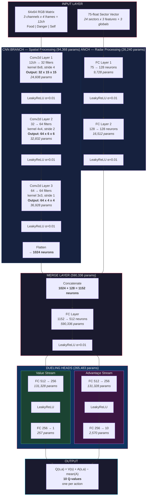
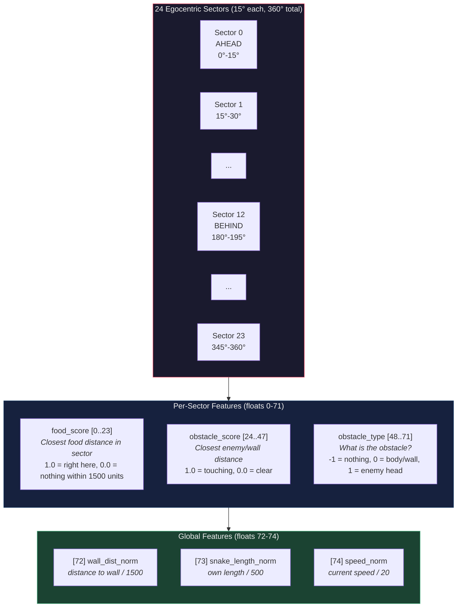

# SlitherBot Gen2

An autonomous bot that plays [slither.io](http://slither.io) using deep reinforcement learning. The bot learns entirely from live gameplay — it controls a real browser, reads the game state through injected JavaScript, and gradually improves through a curriculum of increasingly difficult challenges.

The project started as an experiment to see if a DQN agent could learn survival skills in a competitive multiplayer environment where the rules are simple but the dynamics are chaotic. It turns out the answer is "yes, but it takes a lot of tuning."

## How it works

The training loop is straightforward:

1. A headless Chrome browser connects to slither.io
2. Injected JS extracts the game state (snake positions, food, map boundaries)
3. The state gets converted into a 64x64 pixel matrix + a 75-float sector vector
4. The neural network picks one of 10 actions (turn left/right at various angles, go straight, or boost)
5. The reward signal tells the network what worked and what didn't
6. Repeat thousands of times

The tricky part is everything in between — how to represent the game state, how to design rewards that actually teach useful behavior, and how to avoid the dozen ways training can go wrong.

## Architecture

### Neural Network

We use a **Hybrid Dueling DQN** — a network with **976,427 trainable parameters** that takes two types of input simultaneously and produces Q-values for 10 possible actions.

#### Full Architecture Diagram



#### Network Summary Table

| Layer | Input | Output | Parameters | Activation |
|-------|-------|--------|------------|------------|
| **CNN Branch** | | | **94,368** | |
| Conv1 | 12 x 64 x 64 | 32 x 15 x 15 | 24,608 | LeakyReLU |
| Conv2 | 32 x 15 x 15 | 64 x 6 x 6 | 32,832 | LeakyReLU |
| Conv3 | 64 x 6 x 6 | 64 x 4 x 4 | 36,928 | LeakyReLU |
| Flatten | 64 x 4 x 4 | 1,024 | 0 | — |
| **Sector Branch** | | | **26,240** | |
| FC1 | 75 | 128 | 9,728 | LeakyReLU |
| FC2 | 128 | 128 | 16,512 | LeakyReLU |
| **Merge** | | | **590,336** | |
| Concat | 1024 + 128 | 1,152 | 0 | — |
| FC | 1,152 | 512 | 590,336 | LeakyReLU |
| **Value Head** | | | **131,585** | |
| FC1 | 512 | 256 | 131,328 | LeakyReLU |
| FC2 | 256 | 1 | 257 | — |
| **Advantage Head** | | | **133,898** | |
| FC1 | 512 | 256 | 131,328 | LeakyReLU |
| FC2 | 256 | 10 | 2,570 | — |
| **Total** | | | **976,427** | |

#### Data Flow Diagram

```mermaid
graph LR
    subgraph GAME ["slither.io Browser"]
        GS["Game State<br/>(JS bridge)"]
    end

    subgraph PREPROCESS ["Observation Processing"]
        direction TB
        EGO["Egocentric Rotation<br/><i>Rotate world so snake<br/>heading = UP</i>"]
        MAT["Matrix Builder<br/><i>64x64 x 3 channels</i><br/>Ch0: Food brightness<br/>Ch1: Enemy bodies+heads<br/>Ch2: Own body"]
        FS["Frame Stack<br/><i>Stack last 4 frames</i><br/>3ch x 4 = 12 channels<br/>Enables motion detection"]
        SEC2["Sector Computer<br/><i>24 sectors x 15° each</i><br/>360° radar sweep"]

        EGO --> MAT --> FS
        EGO --> SEC2
    end

    subgraph NETWORK ["HybridDuelingDQN"]
        NN["976K params<br/>Forward pass"]
    end

    subgraph DECISION ["Action Selection"]
        EPS{"ε-greedy?"}
        RAND["Random action<br/><i>(exploration)</i>"]
        BEST["argmax Q(s,a)<br/><i>(exploitation)</i>"]
    end

    subgraph ACTIONS ["10 Actions"]
        A0["0: Straight"]
        A1["1-2: Gentle ±20°"]
        A2["3-4: Medium ±40°"]
        A3["5-6: Sharp ±69°"]
        A4["7-8: U-turn ±103°"]
        A5["9: Boost"]
    end

    GS --> EGO
    FS -->|"12 x 64 x 64"| NN
    SEC2 -->|"75 floats"| NN
    NN -->|"10 Q-values"| EPS
    EPS -->|"prob ε"| RAND
    EPS -->|"prob 1-ε"| BEST
    RAND --> ACTIONS
    BEST --> ACTIONS

    style GAME fill:#2d1b69,stroke:#7c3aed,color:#eee
    style PREPROCESS fill:#1a1a2e,stroke:#e94560,color:#eee
    style NETWORK fill:#0f3460,stroke:#00b4d8,color:#eee
    style DECISION fill:#1b4332,stroke:#52b788,color:#eee
    style ACTIONS fill:#3c1642,stroke:#c77dff,color:#eee
```



#### Why This Architecture?

**Why two input branches?** The CNN processes spatial information — where food and enemies are relative to the snake. But convolutions can miss things at the edges or far away (the 64x64 matrix covers a limited area). The sector vector acts like a radar sweep: it divides the full 360-degree view into 24 pie slices (15 degrees each) and summarizes what's in each one up to 1500 game units away. Together they give the network both detailed close-range spatial awareness and a broader strategic picture.

**Why dueling heads?** Standard DQN outputs Q(s,a) directly for each action. Dueling DQN splits this into "how good is this situation?" (Value) and "how much better is each action than average?" (Advantage). The final Q-value is recombined as: `Q(s,a) = V(s) + A(s,a) - mean(A)`.

This helps because in many game states, *all* actions are roughly equally bad (boxed in by enemies) or equally good (open field with nearby food). The Value stream learns to recognize these situations without needing separate experience for every action in every state. The Advantage stream only needs to learn the *relative* differences between actions, which requires far fewer training samples.

**Why LeakyReLU everywhere?** Standard ReLU can "die" — neurons that output zero stop receiving gradients and never recover. With a chaotic game like slither.io where the input distribution shifts as the bot learns new skills, dead neurons are a real problem. LeakyReLU (slope 0.01 for negative inputs) prevents this while being almost as fast as ReLU.

**Why 976K parameters?** This is intentionally moderate. Larger networks (2M+) overfit to specific game patterns and fail to generalize. Smaller networks (<500K) can't represent the complexity of multi-agent avoidance. The merge layer (590K params — 60% of the network) is the largest component because it needs to learn how spatial (CNN) and distance (sector) information combine to determine value.

### Observation Space

#### Egocentric Rotation

Everything the bot sees is in **egocentric coordinates** — the snake's heading always points "up" in the matrix. This was a critical fix early on. Without it, the network received contradictory training data: a "turn left" action at heading=North looks completely different from "turn left" at heading=East, even though the relative situation is identical.

The rotation math (slither.io uses ang=0 for East, Y-down screen coordinates):
```
ego_x = -sin(ang) * dx + cos(ang) * dy
ego_y = -cos(ang) * dx - sin(ang) * dy
```

#### Matrix Input (3 channels x 64x64, stacked x4 = 12 channels)

| Channel | Content | Encoding |
|---------|---------|----------|
| 0 — Food | Food items within view range | Brightness = closeness. Brighter = nearer food |
| 1 — Danger | Enemy snake bodies and heads | Bodies = medium brightness, Heads = bright (more dangerous) |
| 2 — Self | The bot's own body segments | Prevents self-collision awareness |

We stack the last 4 frames together (giving 12 CNN input channels) so the network can perceive motion — is that enemy approaching or moving away?

#### Sector Vector Input (75 floats)



The sector vector provides distance-based awareness in all directions. Each sector reports:
- **food_score**: How close is the nearest food? (1.0 = adjacent, 0.0 = nothing within 1500 units)
- **obstacle_score**: How close is the nearest danger? (1.0 = about to collide)
- **obstacle_type**: What kind of danger? (-1 = clear, 0 = body segment or wall, 1 = enemy head — more dangerous because it can chase you)

Three global values give the network context about the overall situation regardless of direction.

### Action Space

| Action | Description | Turn Angle | Use Case |
|--------|-------------|------------|----------|
| 0 | Go straight | 0° | Default when path is clear |
| 1-2 | Gentle turn L/R | ~20° | Minor course corrections toward food |
| 3-4 | Medium turn L/R | ~40° | Navigating around obstacles |
| 5-6 | Sharp turn L/R | ~69° | Dodging an approaching enemy |
| 7-8 | U-turn L/R | ~103° | Emergency escape, wall avoidance |
| 9 | Boost | current dir | Chase food, escape danger (costs length) |

The angles were chosen to cover the full range of maneuvers — from gentle course corrections to emergency U-turns. Boost is its own action because it has a strategic cost (you lose length) but tactical value (escape or chase).

## Reward System

The reward function is the heart of the whole system. Every step, the bot receives a sum of reward components that tell it what behaviors to reinforce or avoid.

### Per-step rewards (received every game tick)

| Component | How it works | Typical range |
|-----------|-------------|---------------|
| **Survival** | Small positive reward just for being alive. Grows slowly over time (escalation) so longer episodes become increasingly valuable. | +0.1 to +0.8 per step |
| **Food eaten** | Reward proportional to mass gained. This is the primary positive signal. | +2.5 to +5.0 per food unit |
| **Food shaping** | Bonus for moving toward the nearest food, penalty for moving away. Helps early learning when the bot rarely eats by accident. | -2.0 to +2.0 |
| **Wall proximity** | Penalty that increases as the snake approaches the map boundary. Uses a linear ramp: zero at `wall_alert_dist`, maximum at the wall. | 0 to -1.5 |
| **Enemy proximity** | Same ramp-based penalty for being near enemy snakes. | 0 to -1.5 |
| **Enemy approach** | Additional penalty specifically for *getting closer* to an enemy (not just being near one). This teaches the bot to turn away. | 0 to -0.5 |
| **Boost penalty** | Discourages boosting in early stages when the bot doesn't yet know when boosting is useful. | -0.3 |
| **Straight penalty** | Optional penalty for going straight, used in Explorer style to force the bot to turn and explore. | -0.1 |

### Death penalties (received once when the snake dies)

| Cause | Penalty | Notes |
|-------|---------|-------|
| **Wall collision** | -15 to -50 | Varies by stage. Higher in later stages because the bot should know better. |
| **Snake collision** | -15 to -40 | The main learning signal for enemy avoidance. Set too low and the bot ignores enemies. |

### How rewards flow through training

Raw rewards are divided by `reward_scale` (currently 1.0) and clamped to [-10, +10] before being stored in the replay buffer. This prevents extreme values from destabilizing training.

The network learns through **n-step returns** with variable discount factor (gamma). A higher gamma means the bot cares more about future rewards — important for learning to avoid enemies you can see coming from far away, but harder to train. That's why gamma increases across curriculum stages: 0.85 → 0.93 → 0.97.

## Curriculum Learning

Instead of throwing the bot into the deep end, we teach skills one at a time through a 4-stage curriculum. Each stage emphasizes different reward components and has its own promotion criteria.

### Stage 1: FOOD_VECTOR
**Goal:** Learn to eat food and move purposefully.

The bot starts here knowing nothing. Food reward is high (3.0), food shaping is strong (0.5), and death penalties are mild (-15). There's no enemy penalty at all — we don't want the bot to be afraid of everything, just learn to navigate toward food.

- **Gamma:** 0.85 (short-term focus)
- **Max steps:** 300 (short episodes, fast iteration)
- **Promote when:** avg_food >= 5 AND avg_steps >= 50 over 200 episodes

### Stage 2: WALL_AVOID
**Goal:** Learn to stay away from the map boundary.

Food reward decreases (2.0) and wall proximity penalty increases sharply (1.5). Wall death penalty jumps to -40. The bot already knows how to eat, now it needs to learn spatial awareness.

- **Gamma:** 0.93 (medium-term planning)
- **Max steps:** 500
- **Promote when:** avg_steps >= 55 AND wall_death_rate < 12%

### Stage 3: ENEMY_AVOID
**Goal:** Learn to detect and dodge enemy snakes.

This is the hardest stage. The bot must maintain food collection skills while learning entirely new avoidance behaviors. Enemy proximity penalty is strong (1.5), the alert distance is large (1500 units), and snake death penalty is harsh (-40).

Food reward is kept high (5.0) so the bot doesn't "forget" how to eat — a real risk when adding strong negative signals.

- **Gamma:** 0.97 (long-term planning — see the enemy coming, start turning early)
- **Max steps:** 1000
- **Promote when:** avg_steps >= 100

### Stage 4: MASS_MANAGEMENT
**Goal:** Optimize for long-term growth — balance food collection, survival, and strategic use of boost.

Length bonus (0.02 per unit of length) rewards the bot for being big, not just eating. Enemy penalties are slightly relaxed compared to Stage 3 because the bot should know how to dodge by now and can afford calculated risks.

- **Gamma:** 0.97
- **Max steps:** 2000
- **No promotion** — this is the final stage

### Reward weights by stage

| Parameter | S1: Food | S2: Wall | S3: Enemy | S4: Mass |
|-----------|----------|----------|-----------|----------|
| food_reward | 3.0 | 2.0 | 5.0 | 5.0 |
| food_shaping | 0.5 | 0.15 | 0.1 | 0.1 |
| survival | 0.1 | 0.5 | 0.8 | 0.3 |
| death_wall | -15 | -40 | -40 | -35 |
| death_snake | -15 | -20 | -40 | -25 |
| wall_proximity_penalty | 0.3 | 1.5 | 0.5 | 0.5 |
| enemy_proximity_penalty | 0.0 | 0.0 | 1.5 | 0.8 |
| enemy_approach_penalty | 0.0 | 0.0 | 0.5 | 0.3 |
| enemy_alert_dist | 800 | 800 | 1500 | 1000 |
| gamma | 0.85 | 0.93 | 0.97 | 0.97 |
| max_steps | 300 | 500 | 1000 | 2000 |

### Alternative training styles

Besides the curriculum, there are three static styles for experimentation:

- **Aggressive (Hunter)** — food_reward=20, death_snake=-10. Produces bots that eat aggressively but die constantly to other snakes. Useful for quickly training food collection.
- **Defensive (Safe)** — death penalties at -50, survival=0.5. Produces cautious bots that avoid everything.
- **Explorer (Anti-Float)** — straight_penalty=0.1. Forces the bot to turn and move around instead of floating in place.

## Training Infrastructure

### Browser Engine

The bot plays slither.io through a real browser controlled via Selenium. A JavaScript bridge is injected into the page that exposes game internals:

- `_botGetState()` — reads snake positions, food locations, map variables
- `_botActAndRead(angle, boost)` — sends an action and reads the resulting state in one call

The JS injection is persistent (injected once per session, not per call), which reduced step overhead from ~110ms to ~52ms.

### Multi-Agent Training

Multiple Chrome instances run in parallel via `SubprocVecEnv` (multiprocessing). Each agent plays independently, but they all feed experience into a shared replay buffer and update the same network.

Auto-scaling monitors CPU, RAM, and step latency to add or remove agents dynamically. Each agent uses ~500MB RAM.

### Experience Replay

We use **Prioritized Experience Replay (PER)** with a SumTree data structure. Transitions with high TD-error (where the network's prediction was most wrong) get sampled more frequently. This means the network spends more time learning from surprising or difficult situations.

The replay buffer stores tuples of `(state, action, reward, next_state, done, gamma)` with gamma stored per-transition because it varies by curriculum stage.

### Exploration

Epsilon-greedy with exponential decay:
- Start: 1.0 (100% random actions)
- End: 0.08 (8% random)
- Decay: calibrated so epsilon reaches ~0.5 after about 780 episodes with 5 agents

### Checkpoints and Lineage

Every 50 episodes, the trainer saves a checkpoint containing the network weights, optimizer state, replay buffer, epsilon, and curriculum stage. Each training run gets a UID (`YYYYMMDD-8hexchars`) and tracks its parent UID for lineage.

Training metrics are logged to CSV with columns for reward, steps, food, death cause, Q-values, gradient norms, action distributions, and more.

## Analysis

The analyzer generates 16 charts and a markdown report:

```bash
# Analyze the latest training run
python training_progress_analyzer.py --latest

# Analyze a specific run by UID
python training_progress_analyzer.py --uid 20260214-a3f7b2c1

# Skip chart generation (faster, report only)
python training_progress_analyzer.py --latest --no-charts
```

Charts include: training dashboard, stage progression, death analysis, food efficiency, Q-value trends, action distributions, learning detection, MaxSteps analysis, and more.

## Quick Start

### Prerequisites
- Python 3.10+
- Chrome or Chromium
- ~500MB RAM per agent

### Installation
```bash
pip install torch selenium numpy pandas matplotlib
```

### Run training
```bash
# Single agent, default curriculum
python trainer.py

# Resume from checkpoint
python trainer.py --resume

# 3 agents with auto-scaling up to 10
python trainer.py --num_agents 3 --auto-num-agents --max-agents 10

# Watch the bot play (opens browser window)
python trainer.py --view-plus

# Force a specific curriculum stage
python trainer.py --stage 3

# Use a specific training style
python trainer.py --style "Aggressive (Hunter)"

# Full reset (deletes logs, checkpoints, CSV)
python trainer.py --reset
```

### CLI Reference

| Flag | Description |
|------|-------------|
| `--num_agents N` | Number of parallel browser agents |
| `--view` | Show browser window for first agent |
| `--view-plus` | Browser + debug overlay |
| `--resume` | Load from checkpoint |
| `--stage N` | Force curriculum stage (1-4) |
| `--style NAME` | Training style name |
| `--url URL` | Game server URL |
| `--backend selenium\|websocket` | Browser backend |
| `--auto-num-agents` | Enable agent auto-scaling |
| `--max-agents N` | Maximum agents for auto-scale |
| `--reset` | Delete all logs and checkpoints |

## File Structure

| File | Role |
|------|------|
| `trainer.py` | Main training loop, multi-agent orchestration, auto-scaling |
| `agent.py` | DQN agent — action selection, network optimization, target updates |
| `model.py` | HybridDuelingDQN network definition |
| `slither_env.py` | Gym-like environment — observation processing, reward calculation, curriculum |
| `browser_engine.py` | Selenium automation + JavaScript bridge |
| `config.py` | Configuration dataclasses (hyperparameters, buffer settings) |
| `styles.py` | Reward weight definitions for each curriculum stage and training style |
| `per.py` | Prioritized Experience Replay with SumTree |
| `training_progress_analyzer.py` | Post-training analysis — 16 charts + markdown report |
| `training_stats.csv` | Raw episode-level metrics |

## Performance

| Metric | Value |
|--------|-------|
| Step latency (optimized) | ~52ms |
| Step latency (original) | ~110ms |
| RAM per agent | ~500MB |
| Agents on 8GB machine | 5-10 |
| Training throughput (1 agent) | ~19 steps/sec |

## Known Limitations

- **Server anti-bot**: slither.io servers reject non-browser WebSocket connections at the TCP level. Native WebSocket clients (Python, Node.js) are all blocked. The only working approach is controlling a real browser via Selenium.
- **Step latency**: Even optimized, 52ms per step is slow compared to simulated environments. This limits how fast the bot can learn.
- **Stage 4 instability**: The MASS_MANAGEMENT stage has historically been unstable — Q-values can explode when length_bonus creates a runaway reward signal. Needs careful gamma/reward tuning.
