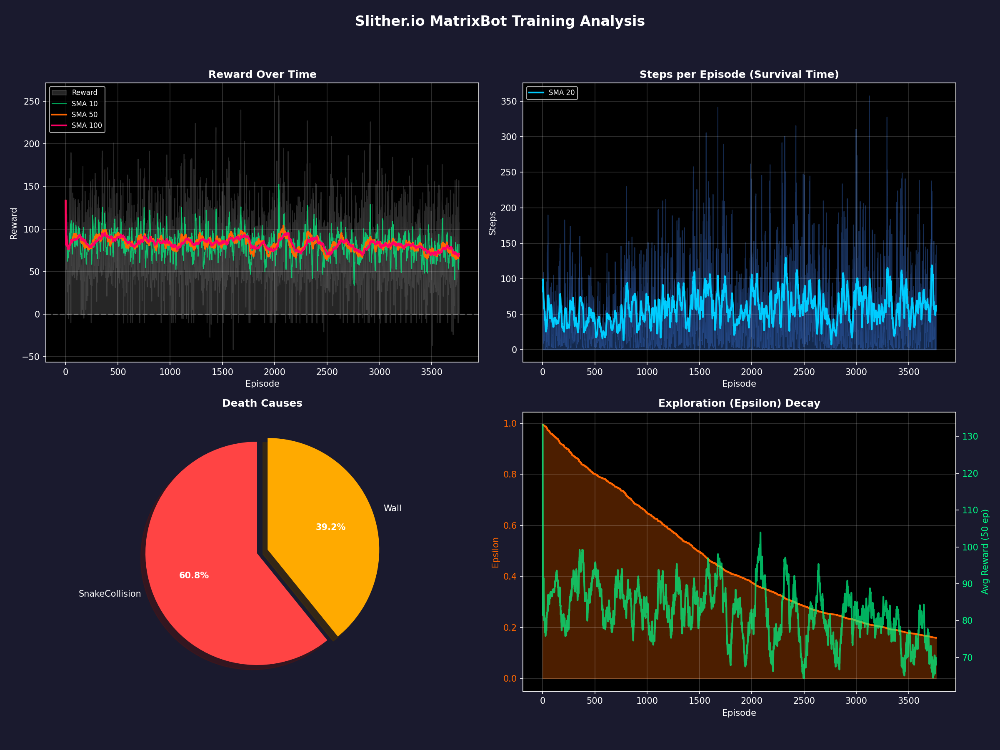
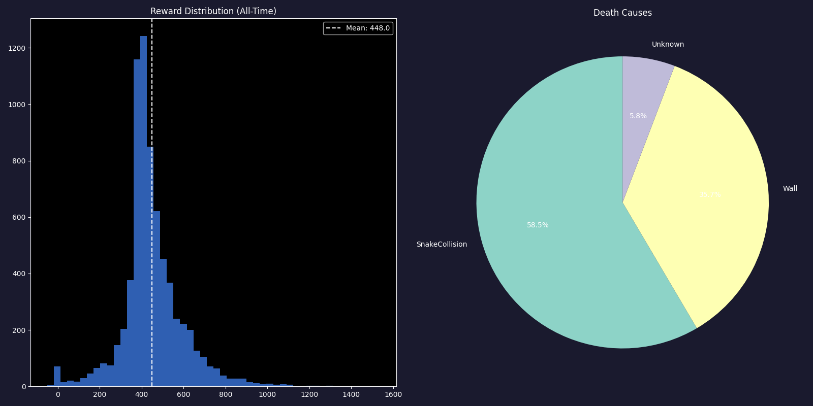

# 🐍 Slither.io MatrixBot Training Report
**Date:** 2026-02-09 17:35:32  
**Total Episodes:** 7268  
**Recent Analysis Window:** Last 50 episodes

## 📊 Executive Summary (Recent Performance)
| Metric | Average | Trend (vs All-Time) | Best | Worst |
| :--- | :---: | :---: | :---: | :---: |
| **Reward** | 454.89 | ↘️ -30.39 | 810.58 | 9.05 |
| **Survival (Steps)** | 44.48 | ↘️ -11.00 | 177.00 | 2.00 |
| **Food Eaten** | 24.94 | ↘️ -2.01 | 47.00 | 1.00 |
| **Loss** | 2.48 | ↘️ +0.51 | 5.88 | 0.36 |

## 📅 Multi-Period Analysis
Comparative performance over different time windows.

| Metric | Last 50 | Last 100 | Last 500 | Last 1000 | Last 5000 | Total |
| :--- |:---: |:---: |:---: |:---: |:---: |:---: |
| **Reward** | 454.89 | 486.21 | 511.17 | 498.31 | 487.51 | 485.28 |
| **Steps** | 44.48 | 52.10 | 61.12 | 57.35 | 57.25 | 55.48 |
| **Food** | 24.94 | 26.64 | 28.35 | 27.37 | 27.34 | 26.95 |
| **Loss** | 2.48 | 2.30 | 2.07 | 2.02 | 1.96 | 1.96 |

## 📈 Detailed Statistics
### Recent (Last 50) vs Full History
| Metric | Recent Mean | Recent Std Dev | All-Time Mean | All-Time Std Dev |
| :--- | :---: | :---: | :---: | :---: |
| Beta | 1.0000 | 0.0000 | 0.9935 | 0.0490 |
| Epsilon | 0.4954 | 0.0040 | 0.4902 | 0.0134 |
| Food | 24.9400 | 8.2200 | 26.9536 | 9.9010 |
| LR | 0.0000 | 0.0000 | 0.0000 | 0.0000 |
| Loss | 2.4765 | 1.3724 | 1.9645 | 1.1586 |
| Reward | 454.8852 | 140.2663 | 485.2788 | 173.2656 |
| Stage | 1.0000 | 0.0000 | 1.0000 | 0.0000 |
| Steps | 44.4800 | 35.5575 | 55.4777 | 45.0247 |
| LearningRate | 0.0000 | 0.0000 | 0.0000 | 0.0000 |

## 💀 Death Analysis
| Cause | Recent Count | Recent % | All-Time % |
| :--- | :---: | :---: | :---: |
| SnakeCollision | 32 | 64.0% | 59.1% |
| Wall | 18 | 36.0% | 40.5% |
| Unknown | 0 | 0.0% | 0.4% |

## ⚙️ Training Health
- **Current Epsilon:** 0.4981
- **Current Learning Rate:** 0.000000
- **Current Beta (PER):** 1.0000

## 🖼️ Charts

