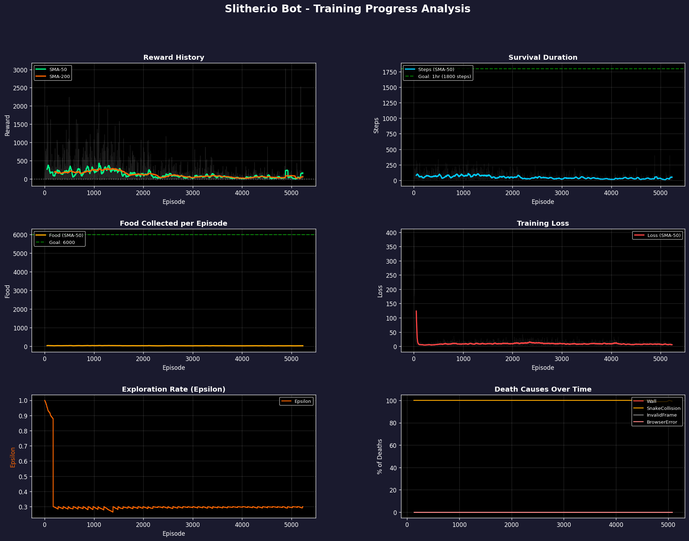
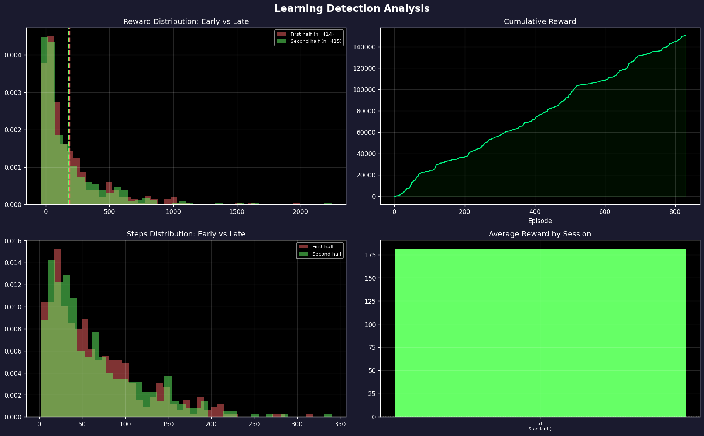
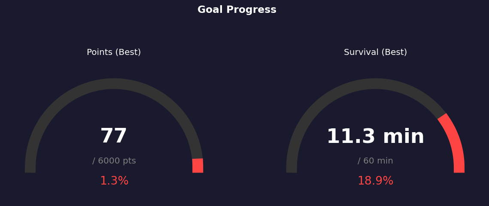

# Slither.io Bot - Training Progress Report

**Generated:** 2026-02-12 23:45:38  
**Total Episodes:** 1092  
**Training Sessions:** 1

## Verdict: NOT LEARNING (Confidence: 45%)

**Goal Feasibility:** UNLIKELY (5-25% chance) without tuning

### Warnings
- Rewards flat: change = 13.0 between halves

## Key Statistics

| Metric | Mean | Std | Min | Max | P50 | P95 |
|--------|------|-----|-----|-----|-----|-----|
| Reward | 199.07 | 265.70 | -38.58 | 2242.28 | 101.36 | 716.78 |
| Steps | 68.20 | 55.11 | 2.00 | 340.00 | 54.00 | 173.90 |
| Food | 28.63 | 10.97 | 0.00 | 77.00 | 26.00 | 49.00 |
| Loss | 12.61 | 35.81 | 0.53 | 392.24 | 6.54 | 20.33 |

## Goal Progress

| Target | Current Best | Goal | Progress |
|--------|-------------|------|----------|
| Points | 77 | 6,000 | 1.3% |
| Survival | 11.3 min | 60 min | 18.9% |

## Session History

| # | Style | Episodes | Avg Reward | Avg Steps |
|---|-------|----------|------------|----------|
| 1 | Standard (Curriculum) | 1-1092 | 199.1 | 68 |

## Recommendations

Some learning signals present but not strong enough.
  1. Fine-tune hyperparameters
  2. Increase training duration significantly
  3. Consider curriculum adjustments

1. Average episode too short. Consider:
     - Reducing death penalties to avoid discouraging exploration
     - Adding survival bonus to incentivize staying alive

## Charts

