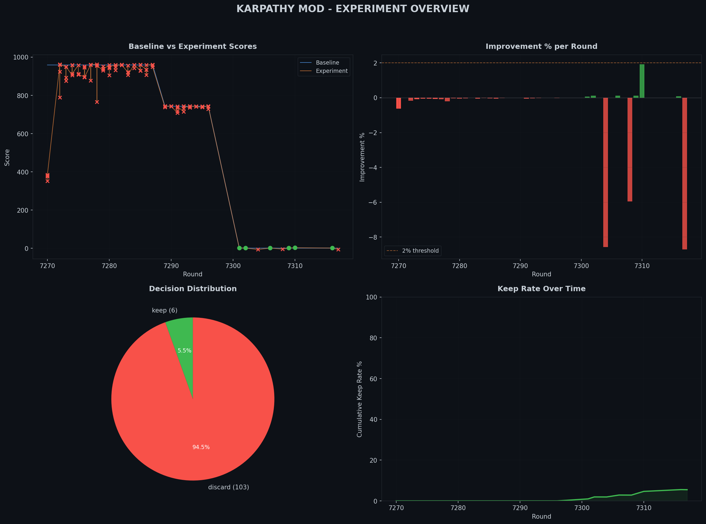
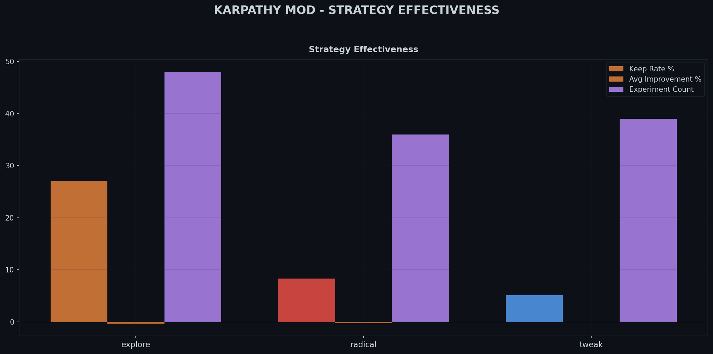
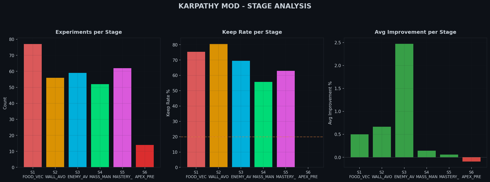
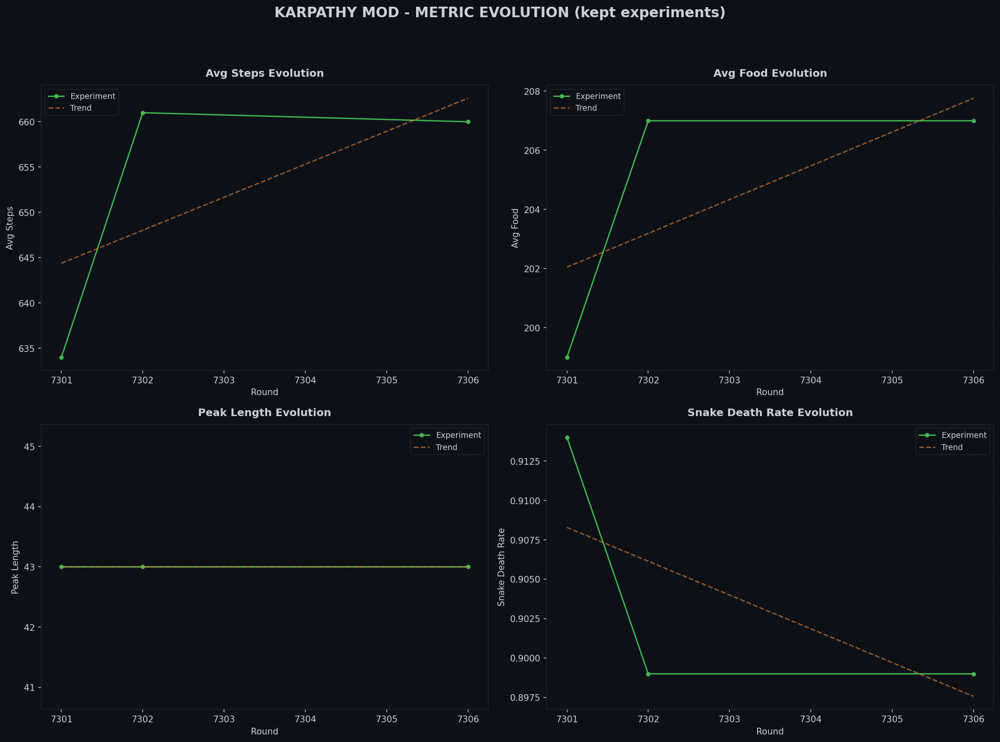
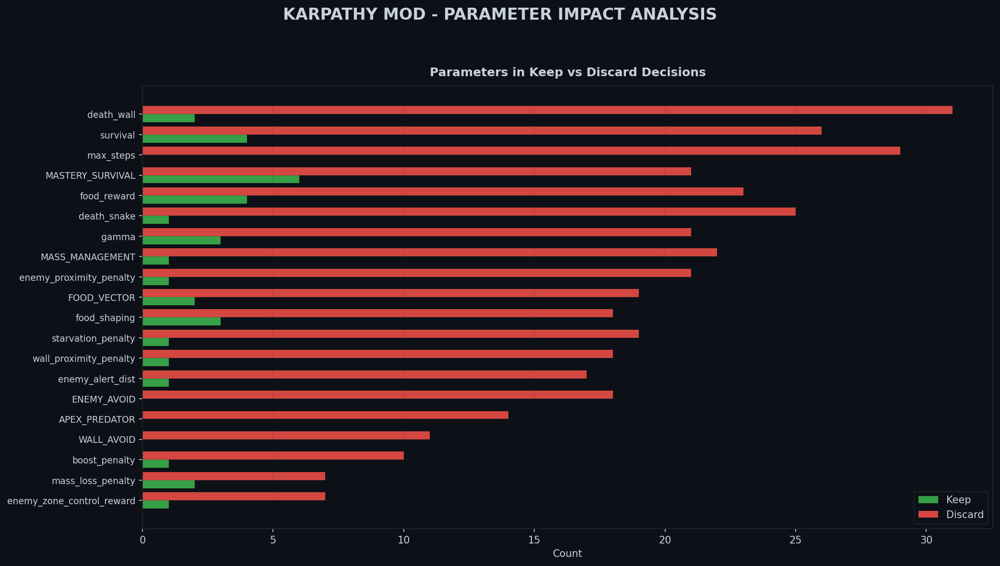
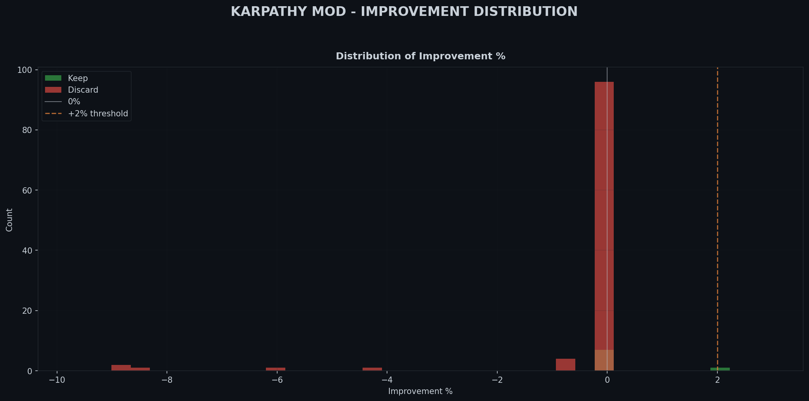
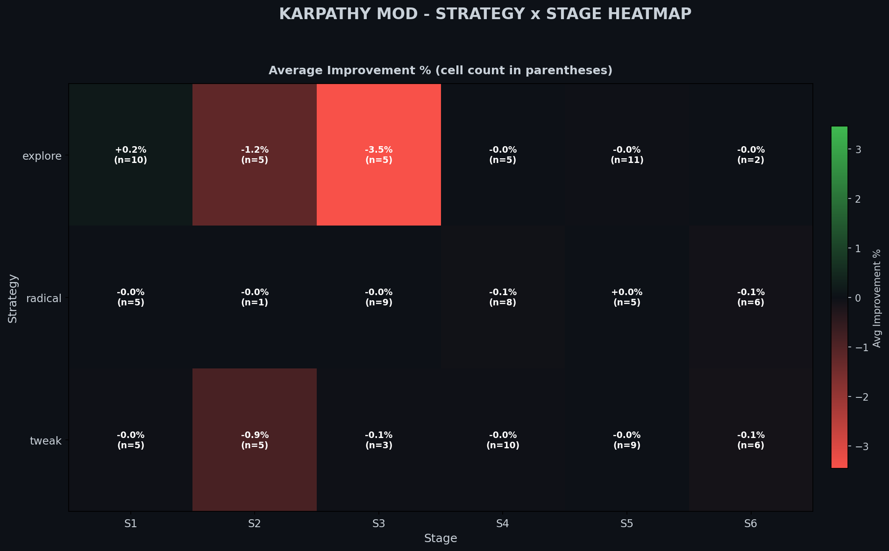

# Karpathy Mod Experiment Report
*Generated: 2026-04-02 14:51:08*

## Summary

| Metric | Value |
|--------|-------|
| Total experiments | 114 |
| Keep rate | 7.9% |
| Kept | 9 |
| Discarded | 105 |
| Inconclusive | 0 |
| Best improvement | +2.08% |
| Worst regression | -8.72% |
| Avg improvement | -0.32% |
| Trend | **IMPROVING** |

## Strategy Effectiveness

| Strategy | Count | Kept | Keep Rate | Avg Improvement | Best |
|----------|------:|-----:|----------:|----------------:|-----:|
| explore | 41 | 6 | 14.6% | -0.48% | +2.08% |
| radical | 35 | 2 | 5.7% | -0.29% | +0.11% |
| tweak | 38 | 1 | 2.6% | -0.16% | +0.06% |

## Stage Performance

| Stage | Name | Count | Kept | Keep Rate | Avg Improvement |
|------:|------|------:|-----:|----------:|----------------:|
| S1 | FOOD_VECTOR | 21 | 2 | 9.5% | +0.17% |
| S2 | WALL_AVOID | 11 | 0 | 0.0% | -0.95% |
| S3 | ENEMY_AVOID | 18 | 0 | 0.0% | -1.46% |
| S4 | MASS_MANAGEMENT | 23 | 1 | 4.3% | -0.04% |
| S5 | MASTERY_SURVIVAL | 27 | 6 | 22.2% | -0.02% |
| S6 | APEX_PREDATOR | 14 | 0 | 0.0% | -0.09% |

## Top 5 Best Kept Experiments

| Round | Improvement | Strategy | Stage | Description |
|------:|------------:|----------|------:|-------------|
| R7323 | +2.08% | explore | S1 | [explore] S1/FOOD_VECTOR: food_reward: 3.5666 -> 3.8172; death_snake: -15 -> -17 |
| R7310 | +1.93% | explore | S1 | [explore] S1/FOOD_VECTOR: death_wall: -15 -> -13.415340727031698; food_shaping:  |
| R7302 | +0.12% | explore | S5 | [explore] S5/MASTERY_SURVIVAL: enemy_alert_dist: 2000 -> 2051; mass_loss_penalty |
| R7306 | +0.11% | explore | S5 | [explore] S5/MASTERY_SURVIVAL: food_reward: 8.0000 -> 6.8031; survival: 0.3323 - |
| R7309 | +0.11% | radical | S5 | [radical] S5/MASTERY_SURVIVAL: gamma: 0.9700 -> 0.9770; food_shaping: 0.2500 ->  |

## Top 5 Worst Discarded Experiments

| Round | Improvement | Strategy | Stage | Description |
|------:|------------:|----------|------:|-------------|
| R7317 | -8.72% | explore | S3 | [explore] S3/ENEMY_AVOID: starvation_penalty: 0.0080 -> 0.0114; food_reward: 5.0 |
| R7322 | -8.71% | radical | S3 | [radical] S3/ENEMY_AVOID: starvation_grace_steps: 60 -> 74; death_wall: -40 -> - |
| R7304 | -8.57% | explore | S3 | [explore] S3/ENEMY_AVOID: gamma: 0.9500 -> 0.9291; enemy_proximity_penalty: 1.50 |
| R7308 | -5.96% | explore | S2 | [explore] S2/WALL_AVOID: food_shaping: 0.1500 -> 0.0965; survival_escalation: 0. |
| R7318 | -4.41% | tweak | S2 | [tweak] S2/WALL_AVOID: gamma: 0.9300 -> 0.9399 |

## Charts

### Experiment Overview Dashboard

### Strategy Effectiveness

### Stage Analysis

### Metric Evolution

### Parameter Impact Analysis

### Improvement Distribution

### Strategy x Stage Heatmap

### Interactive Explorer
[Open Experiment Explorer](charts/karpathy_experiment_explorer.html)

## Trend Assessment

**IMPROVING**

Keep rate is increasing over time. The mutation system is learning what works.
